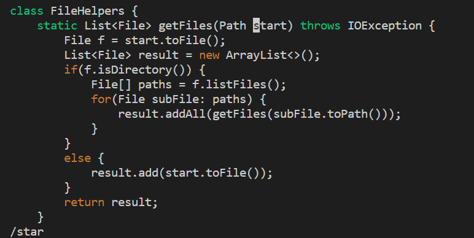
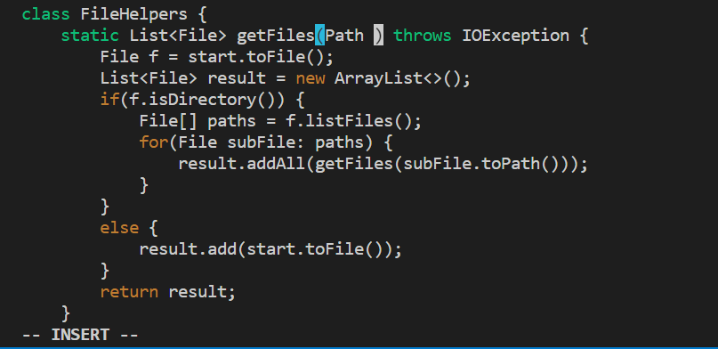
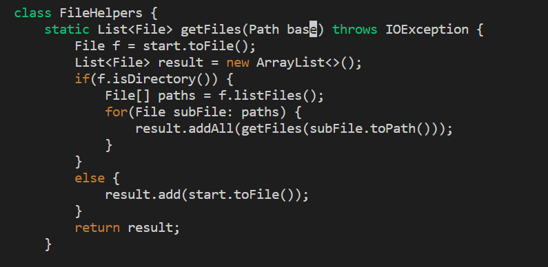

# Task 1
* In `DocSearchServer.java`, change the name of the `start` parameter of `getFiles`, and all of its uses, to instead called `base`.

```
/star <Enter> ce base <Esc> n . n . :wq
```
1. After entering `/star` and `<Enter>`, the cursor jumps to the start of the word "start"


2. After entering `ce`, the whole word is deleted, and we enter the insert mode


3. After entering `base` and `<Esc>`, "base" is entered and we quit the insert mode


4. After entering `n`, the cursor jumps to the next "start"
!
