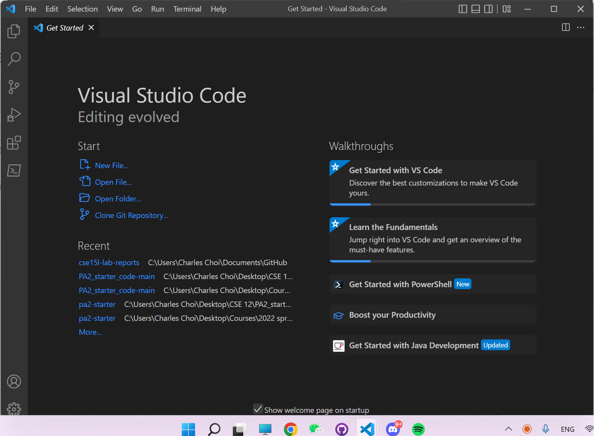

# Welcome to CSE 15L! Here's the toturial for you guys
---
## Installing VScode
Go to the Visual Studio Code website [Download](https://code.visualstudio.com/), and download it for PC or Mac.

## Remote Connection
1. Install OpenSSH by following steps in ["Connect to a remote host"](https://code.visualstudio.com/docs/remote/ssh#_connect-to-a-remote-host)
2. Open a terminal in VScode by (Ctrl or Cmd + ` or use the Terminal -> New Terminal menu option). You should have your own last 2 letters by using the account lookup tool. [AccountLookup](https://sdacs.ucsd.edu/~icc/index.php)
>ssh cs15lfa22zz@ieng6.ucsd.edu