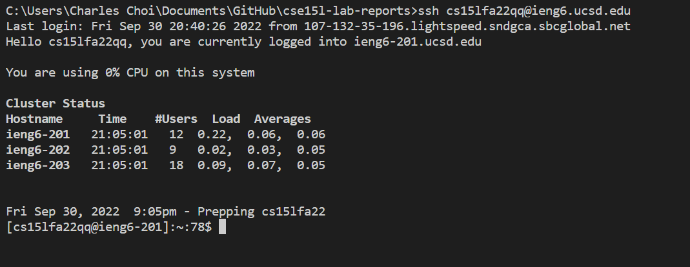
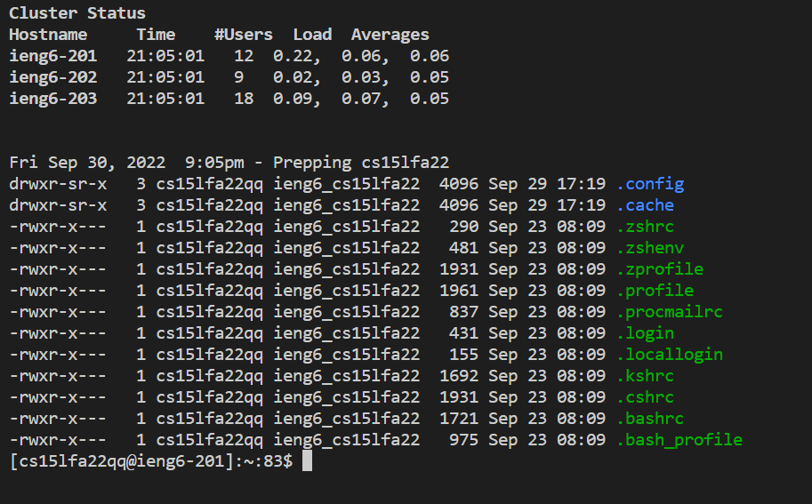
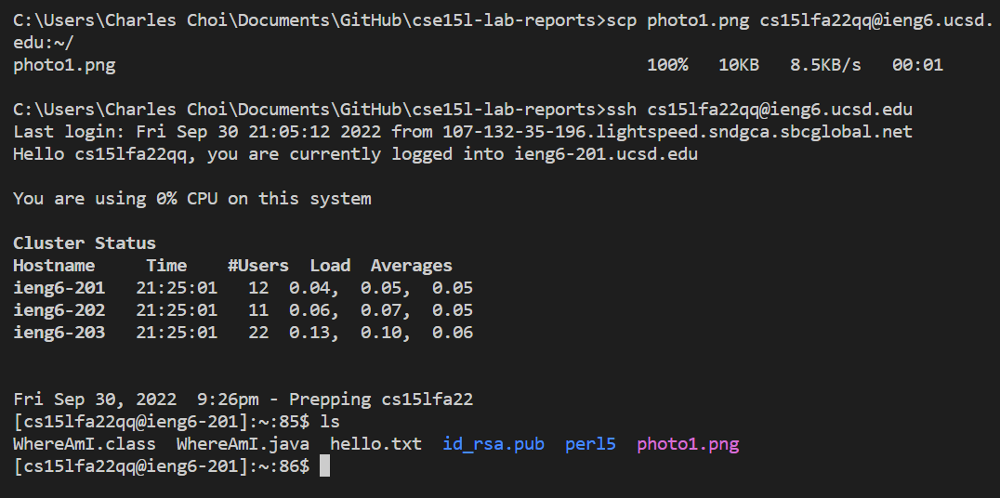
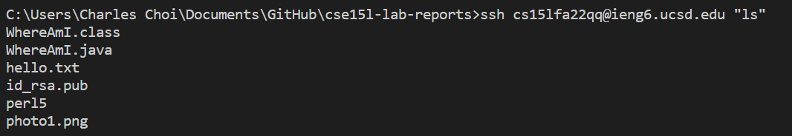

# Welcome to CSE 15L! Here's the tutorial for you guys
---
## Installing VScode
Go to the Visual Studio Code website [Download](https://code.visualstudio.com/), and download it for PC or Mac.

## Remote Connection
1. Install OpenSSH by following steps in ["Connect to a remote host"](https://code.visualstudio.com/docs/remote/ssh#_connect-to-a-remote-host)
2. Open a terminal in VScode by (Ctrl or Cmd + ` or use the Terminal -> New Terminal menu option). You should have your own last 2 letters by using the account lookup tool. [AccountLookup](https://sdacs.ucsd.edu/~icc/index.php)
>$ ssh cs15lfa22zz@ieng6.ucsd.edu

>if you do it the first time on your computer, type in yes for continuing connecting

## Try Some Commands!
* cd ~
changing to root directory
* cd
changing to 
* ls -lat
list all files

* ls <directory>
list the contents of the directory
* cat
display the contents of one or multiple contents
* cp
copy the contents

## Moving Files over SSH with scp
Copy the file on your computer to the virtual machine by typing in
> scp moveMe.txt cs15lfa22@ieng6.ucsd.edu:~/
Now log in with ssh, and use ls to see the file

## Faster Faster Faster!
* you can write a command in quotes at the end of an ssh command to directly run it on the remote server, then exit. For example, this command will log in and list the home directory on the remote server:
> $ ssh cs15lfa22@ieng6.ucsd.edu "ls"

* You can use semicolons to run multiple commands on the same line in most terminals. For example, try:
> $ cp WhereAmI.java OtherMain.java; javac OtherMain.java; java WhereAmI