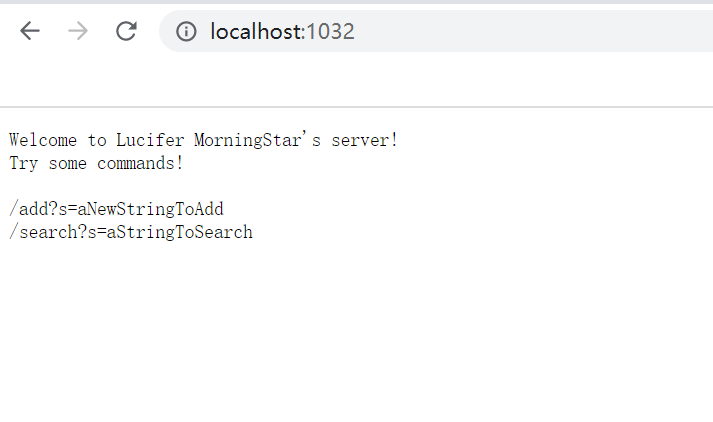
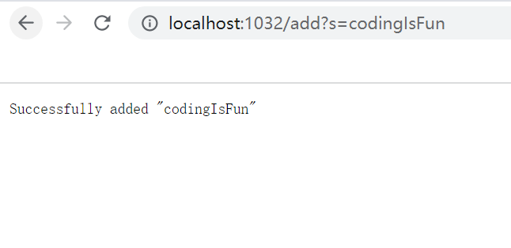
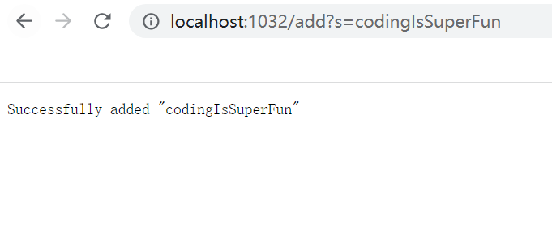
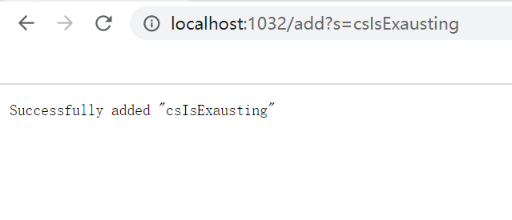
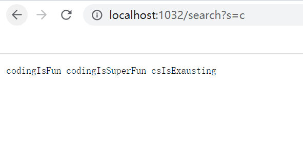
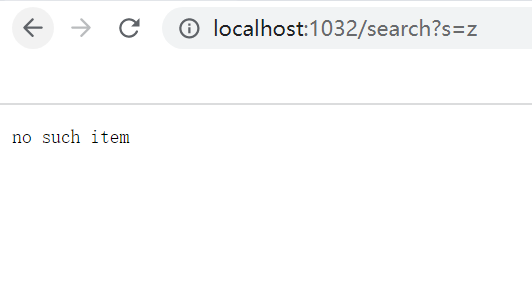
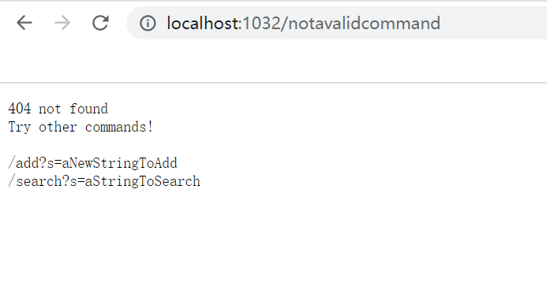

# Part 1 Search Engine
* Code Block

```
class Handler implements URLHandler {
    // The one bit of state on the server: a number that will be manipulated by
    // various requests.
    String[] list = new String[50];
    int index = 0;

    public String handleRequest(URI url) {
        if(url.getPath().equals("/")) {
            return String.format("Welcome to Lucifer MorningStar's server!" 
            + "\n" + "Try some commands!" + "\n" + "\n" + "/add?s=aNewStringToAdd"
            + "\n" + "/search?s=aStringToSearch");
        }

        else if(url.getPath().contains("/search")) {
            String[] parameters = url.getQuery().split("=");
            String stringsFound = "";
            boolean hasItems = false;
            for(int i = 0; i < list.length; i++) {
                if(list[i] == null) {
                    continue;
                }

                if(list[i].toLowerCase().contains(parameters[1].toLowerCase())) {
                    stringsFound += (list[i] + " ");
                    hasItems = true;
                }
                
            }
            if(hasItems) {
                return stringsFound;
            }

            else {
                return "no such item";
            }
        }
        else {
            System.out.println("Path: " + url.getPath());
            if(url.getPath().contains("/add")) {
                if(index < list.length) {
                    String[] parameters = url.getQuery().split("=");
                    if(parameters[0].equals("s")) {
                        list[index] = parameters[1];
                        index++;
                        return "Successfully added " + "\"" + parameters[1] + "\"";
                    }
                }
                else {
                    return "The Server Is Full...";
                }
            }
        }
        return "404 not found" + "\n" + "Try other commands!" + "\n" 
        + "\n" + "/add?s=aNewStringToAdd"
        + "\n" + "/search?s=aStringToSearch";
    }
}

class SearchEngine {
    public static void main(String[] args) throws IOException {
        if(args.length == 0){
            System.out.println("Missing port number! Try any number between 1024 to 49151");
            return;
        }

        int port = Integer.parseInt(args[0]);

        Server.start(port, new Handler());
    }
}

```
**Screenshot 1 (home directory page)**



* Methods Called

1. getPath()

    No argument is put in this method. If the input url changes, this would change as well
2. equals()

    "/" is the argument put in this method.
3. format()

    Introduction to the server is the argument as a string to this method

**Screenshot 2-4 (/add?s=aStringToAdd)**







* Methods Called

1. getPath()

    No argument is put in this method. If the input url changes, this would change as well
2. contains()

    "/add" is the argument to this method
3. getQuery()

    No argument is put in this method. If the input url changes, this would change as well
4. split()

    "=" is the argument to this method. If it changes, the splitted query will vary
5. equals()

    "s" is the argument put in this method. If it changes, it will be evaluated to false as the format is
    expected to be "?s="

* Relevant Variables/Fields

1. String[] list

    This variable stores the strings that are added. It has a maximum size of 50
2. int index

    This variable keeps track of how many strings are put into the list
3. String[] parameters

    This variable stores the splitted query

**Screenshot 5 (/search?s=aStringToSearch)**



* Methods Called

1. getPath()

    No argument is put in this method. If the input url changes, this would change as well
2. contains()

    "/search" is the argument to this method
3. getQuery()

    No argument is put in this method. If the input url changes, this would change as well
4. split()

    "=" is the argument to this method. If it changes, the splitted query will vary
5. equals()

    "s" is the argument put in this method. If it changes, it will be evaluted to false as the format is
    expected to be "?s="

* Relevant Variables/Fields

1. String stringsFound

    This variable is the concatenation of all the related strings found in list
2. boolean hasItems

    This variable is true when any string is added to the list, false otherwise
3. String[] parameters

    This variable stores the splitted query

**Screenshot 6 (no such item is found)**




**Screenshot 7 (invalid input url)**




# Part 2 Bugs

## ArrayExamples.java *reversed(int[] arr)*

* The failure-inducing input

```
@Test
  public void testReversed_2(){
    int[] input1 = {1,2,3,4,5};
    assertArrayEquals(new int[]{5,4,3,2,1}, ArrayExamples.reversed(input1));
  }
```

* The symptom

```
testReversed_2(ArrayTests)
arrays first differed at element [0]; expected:<5> but was:<0>
        at org.junit.internal.ComparisonCriteria.arrayEquals(ComparisonCriteria.java:78)
        at org.junit.internal.ComparisonCriteria.arrayEquals(ComparisonCriteria.java:28)
        at org.junit.Assert.internalArrayEquals(Assert.java:534)
        at org.junit.Assert.assertArrayEquals(Assert.java:418)
        at org.junit.Assert.assertArrayEquals(Assert.java:429)
        at ArrayTests.testReversed_2(ArrayTests.java:43)
        ... 32 trimmed
Caused by: java.lang.AssertionError: expected:<5> but was:<0>
        at org.junit.Assert.fail(Assert.java:89)
        at org.junit.Assert.failNotEquals(Assert.java:835)
        at org.junit.Assert.assertEquals(Assert.java:120)
        at org.junit.Assert.assertEquals(Assert.java:146)
        at org.junit.internal.ExactComparisonCriteria.assertElementsEqual(ExactComparisonCriteria.java:8)
        at org.junit.internal.ComparisonCriteria.arrayEquals(ComparisonCriteria.java:76)
        ... 38 more
```

* The bug

```
static int[] reversed(int[] arr) {
    int[] newArray = new int[arr.length];
    for(int i = 0; i < arr.length; i += 1) {
      int temp = arr[i];
      newArray[i] = arr[arr.length - i - 1];
      newArray[arr.length - i -1] = temp;
    }
    return newArray;
  }
```

* WHY?

The reason why this bug causes this symptom is that it assigns all the zeros in the newArray
to the original arr. It should assign the numbers in the orignal arr to the newArray. Also, it
doesn't return the newArray, but instead returns the arr. The two bugs work together to create
this particular symptom.

```
{1,2,3,4,5} -> {5,4,3,4,5}
// This is what happens...
```

## ListExamples.java*filter(List<String> list, StringChecker sc)*

* My stringChecker is defined to be selecting strings that have "a" in them
```
class TypeChecker implements StringChecker {
    public boolean checkString(String s) {
        if(s.contains("a")) {
            return true;
        }
    return false;
    }
}
```

* The failure-inducing input
```
@Test
  public void testFilter(){
    class TypeChecker implements StringChecker {
      public boolean checkString(String s) {
        if(s.contains("a")) {
          return true;
        }
        return false;
      }
    }
    ArrayList<String> input = new ArrayList<>(Arrays.asList("a", " ", "abc", "b"));
    ArrayList<String> result = new ArrayList<>(Arrays.asList("a", "abc"));

    assertEquals(result, ListExamples.filter(input, new TypeChecker()));
  }
```

* The symptom
```
testFilter(ListTests)
java.lang.AssertionError: expected:<[a, abc]> but was:<[abc, a]>
        at org.junit.Assert.fail(Assert.java:89)
        at org.junit.Assert.failNotEquals(Assert.java:835)
        at org.junit.Assert.assertEquals(Assert.java:120)
        at org.junit.Assert.assertEquals(Assert.java:146)
        at ListTests.testFilter(ListTests.java:22)
```

* The bug
```
static List<String> filter(List<String> list, StringChecker sc) {
    List<String> result = new ArrayList<>();
    for(String s: list) {
      if((sc.checkString(s))) {
        result.add(s);
      }
    }
    return result;
  }
```

* WHY?

The reason why this bug causes this symptom is that the wrong add() method is called. 
Since java can overload a method, we need to choose the correct parameters here, which
should be the string only. The extra 0 would prepend the string to the front of the list,
which changes the order of the expected output.

