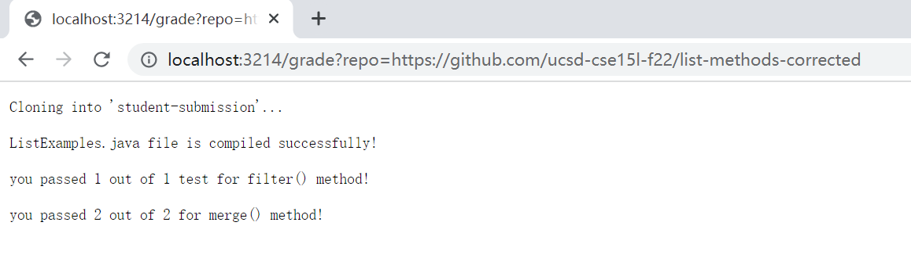

# grade.sh run on web
* [My Grading Script](https://saintlucifur.github.io/cse15l-lab-reports/gradingscript.html)

student-submission: `*https://github.com/ucsd-cse15l-f22/list-methods-corrected*`



```
rm -rf student-submission
git clone $1 student-submission
cd student-submission
```

`rm -f` is used to recursively remove the old student-submission directory without confirmation
`git clone` is used to clone the student directory taking an URL as a parameter
`cd` is used to go into the new student-submission directory we just cloned

```
if  ! [ -e ListExamples.java ]

	then
		echo "ListExamples.java file not found"
		exit 1

	else
		cp ListExamples.java ./../
		cd ..
		javac -cp ".;lib/hamcrest-core-1.3.jar;lib/junit-4.13.2.jar" *.java 2> stderr.txt
fi
```

`if` statement in the fist line, `! [ -e ListExamples.java ]` is evaluated to be `false`, because `-e` checks if the file exists, in this case, the student submitted the file with correct name, therefore, it exists. Then, it goes into the `else` block, `cp` command copies `ListExamples.java` to the parent directory, `cd` command goes back to the parent directory. Then, `javac` would compile the file and use `2> stderr.txt` to redirect the standard error to `stderr.txt`

```
[ -s stderr.txt ]

if [ $? -eq 0 ]

then
	echo "ListExamples.java file or TestListExamples.java file can't compile!"
	exit 1

else
	echo "ListExamples.java file is compiled successfully!"
fi
```

[ -s stderr.txt ] would check if `stderr.txt` is empty, if true, the exit code `$?` would be `0`, non-zero otherwise. Since all the files compile just fine, the `if` statement, [ $? -eq 0] is evaluated to be false, it goes to the `else` block, `echo` command would then print out in the terminal

```
java -cp ".;lib/junit-4.13.2.jar;lib/hamcrest-core-1.3.jar" org.junit.runner.JUnitCore TestListExamples > stdout.txt
```

