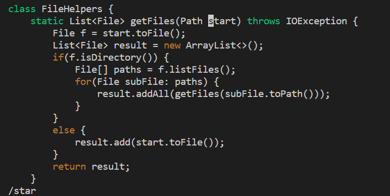
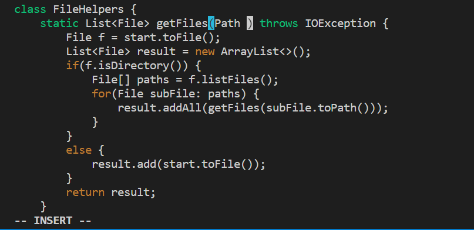
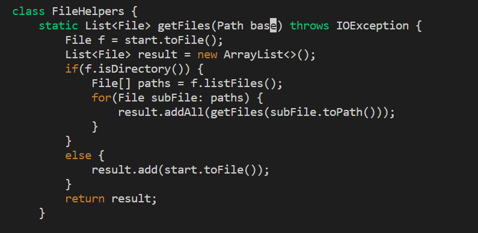
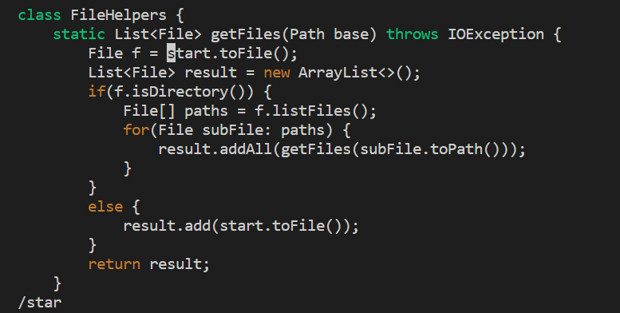
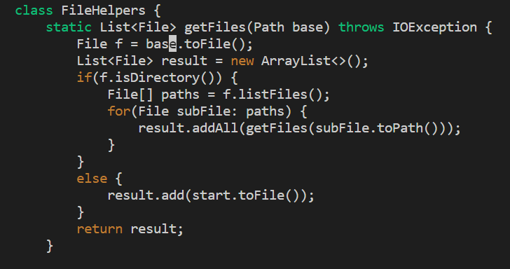
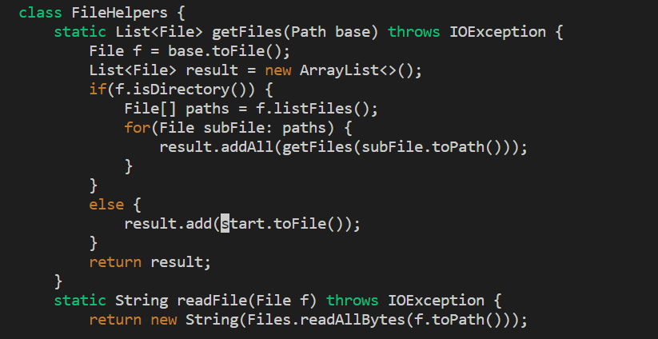

# Part 1
* Task 1: In `DocSearchServer.java`, change the name of the `start` parameter of `getFiles`, and all of its uses, to instead called `base`.

```
/star <Enter> ce base <Esc> n . n . :wq <Enter>
```
1. After entering `/star` and `<Enter>`, the cursor jumps to the start of the word "start"


2. After entering `ce`, the whole word is deleted, and we enter the insert mode


3. After entering `base` and `<Esc>`, "base" is entered and we quit the insert mode


4. After entering `n`, the cursor jumps to the next "start"


5. After entering `.`, the both `ce`, `base` and `<Esc>` commands are repeated


6. After entering another `n`, the cursor jumps to the next "start"


7. After entering another `.`, the same commands are repeated


8. After entering `wq` and `<Enter>`, the file is saved

# Part 2
**Remote vs Local**

My goal is to edit the start.sh bash script and add `echo "File edited"` to the script

* Locally takes 150 seconds

`git clone` the week6-demo directory to the local destination

use GitHub Desktop and VScode to open the directory and edit the start.sh script

use `scp start.sh cs15lfa22qq@ieng6.ucsd.edu:~/` to copy the file to remote machine

log in and run it remotely

* On remote takes 31 seconds

log in to use vim to directly edit the file and run it

1. I prefer editing directly on the remote machine using vim, because it saves some time trying to figure out which directory the files are in if I choose to do scp

2. If the task involves a lot of coding, which might result in unnoticeable compiling errors if doing remotely using vim. In that case, I would choose to work on VScode, and scp the file to the remote machine. If the task involves small amount of coding, I prefer to do in remotely using vim.